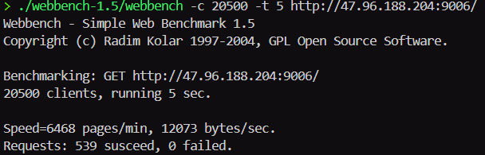

# Tinywebserver

Linux 下轻量级C/C++服务器，支持模拟proactor/reactor事件处理模式，使用线程池实现高并发

### 使用方法
- 在本地创建MySql数据库及user表, 在main.cpp中修改数据库名字，用户名及密码
- 编译项目后，可以使用以下参数启动可执行文件
    - l : 指定日志写入方式，0为同步，1为异步
    - c ：指定是否开启日志，0为开启，1为关闭
    - p : 端口号
    - m : 指定监听socket和连接socket的工作模式，此项输入的数字将会被解析成二进制数，如指定3则被解析为11，指定二者工作模式均为ET
### 更新日志：

- 使用c++11与moduo网络库思想重构该项目
- 加入内存池

### 测试
通过test_pressure文件夹下的webbench可以对项目进行压测
测试命令：
`./webbench -t(指定测试时间) 5 -c(指定客户端并发数量) 10000 http://ip:port/`

远程阿里云服务器使用LT + LT模式进行webbench压测后的结果:

> 由于笔者购买的阿里云轻量应用服务器只有3Mbps带宽，所以QPS不甚理想

使用本地带宽近似88Mbps的WSL环境测试，关闭日志的前提下使用LT+ET的工作模式得到的QPS最高，接近10000+
